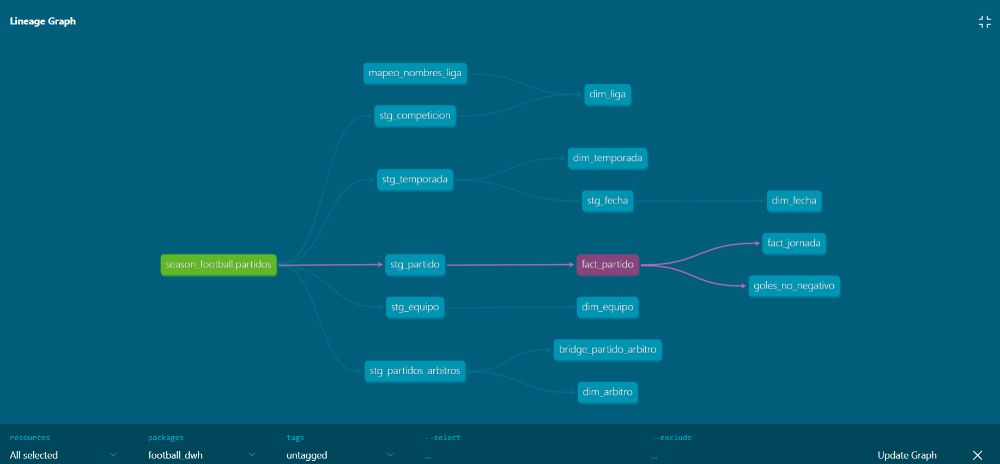

# Football DWH — Data Warehouse de las 5 Grandes Ligas Europeas

Data Warehouse construido desde cero con datos de [football-data.org](https://www.football-data.org), cubriendo Premier League, La Liga, Bundesliga, Serie A y Ligue 1.

## Estado del proyecto: ✅ Pipeline completo — Bronze → Staging → Marts funcional, validado y contenerizado (Docker Compose)

---

## Alcance confirmado

| Aspecto | Decisión |
|---|---|
| Ligas | Premier League (PL), La Liga (PD), Bundesliga (BL1), Serie A (SA), Ligue 1 (FL1) |
| Temporadas | 2023, 2024, 2025 — únicas 3 consistentes en las 5 ligas con el plan Free de la API |
| Volumen | 5,256 partidos históricos |
| Plan API | Free tier (10 calls/minuto) |
| Motor de base de datos | SQL Server Express (local) |
| Transformación | dbt Core 1.11.11 + dbt-sqlserver 1.10.0 |
| Contenerización | Docker + Docker Compose (pipeline + dbt, orquestados) |
| Orquestación futura | Airflow (pendiente — roadmap DE) |

---

## Arquitectura

```
API football-data.org
        │
        ▼  src/extract.py (idempotente, respeta rate limit)
   data/raw/*.json   (15 archivos: una liga-temporada por archivo)
        │
        ▼  src/load.py (idempotente, anti-duplicados)
   bronze.partidos   (SQL Server — capa cruda, semicruda)
        │
        ▼  dbt Core (transform/football_dwh/)
   stg.*             (6 vistas — limpieza técnica, tipado, JSON desempacado)
        │
        ▼
   dm.*              (7 tablas — modelo dimensional listo para consumo)
```

`src/main.py` orquesta extract → load en una sola ejecución. Las funciones están escritas de forma que un orquestador externo (Airflow) pueda llamarlas sin reescritura.

### Filosofía de la capa Bronze: semicruda

Bronze es una fotografía fiel de la API, no un modelo de datos. Se guardan aplanadas solo las columnas necesarias para operar (clave, fechas de control, status, ids de equipos, jornada), y el resto del partido completo se guarda intacto como JSON en `payload_json`. Esto evita perder información si la fuente agrega campos nuevos en el futuro, y pospone toda decisión de modelado a la capa de transformación (dbt).

**Esquema de `bronze.partidos`:**

| Columna | Tipo | Propósito |
|---|---|---|
| `id` | INT (PK) | Identificador único del partido |
| `utcdate` | NVARCHAR(50) | Fecha del partido (texto, sin tipar — fiel a la fuente) |
| `matchday` | INT | Jornada — necesaria para `fact_jornada` sin parsear JSON |
| `home_team_id` / `away_team_id` | INT | Para JOINs frecuentes hacia `dim_equipo` sin parsear JSON |
| `lastupdated` | NVARCHAR(50) | Última modificación según la fuente (para incremental futuro) |
| `status` | NVARCHAR(20) | FINISHED, AWARDED, etc. — se filtra seguido, por eso aplanado |
| `liga_archivo` | NVARCHAR(10) | Control: de qué archivo vino |
| `temporada_archivo` | NVARCHAR(10) | Control: de qué archivo vino |
| `fecha_carga` | DATETIME | Auditoría: cuándo se cargó esta fila |
| `payload_json` | NVARCHAR(MAX) | El partido completo, crudo, tal cual la API |

---

## Modelo dimensional (capa Gold — construido y validado)

Esquema constelación con dos tablas de hechos compartiendo dimensiones:

### Dimensiones

| Tabla | Filas | Descripción |
|---|---|---|
| `dm.dim_liga` | 5 | Código, nombre oficial (API) + nombre comercial (seed), país |
| `dm.dim_temporada` | 15 | Año, liga, fechas inicio/fin (3 temporadas × 5 ligas) |
| `dm.dim_equipo` | 119 | Id, nombre, nombre corto, TLA. SCD Tipo 1 — sin historial, confirmado que no cambia en la ventana 2023-2025 |
| `dm.dim_arbitro` | variable | Id, nombre, nacionalidad — catálogo de árbitros reales únicamente |
| `dm.dim_fecha` | 1,018 | Calendario completo 2023-08-11 → 2026-05-24, con año, mes, día, trimestre, semana ISO |

### Hechos y Bridge

| Tabla | Filas | Grano |
|---|---|---|
| `dm.fact_partido` | 5,256 | 1 fila = 1 partido. Métricas: goles FT/HT, resultado, status |
| `dm.bridge_partido_arbitro` | 5,262 | 1 fila = 1 relación partido-árbitro. Incluye los 38 partidos sin árbitro registrado (NULL) para trazabilidad |
| `dm.fact_jornada` | 10,512 | 1 fila = 1 equipo en 1 jornada. Tabla de posiciones acumulativa derivada de `fact_partido` por agregación con `SUM OVER (PARTITION BY equipo, liga, temporada ORDER BY jornada)` |

---

## Capa de transformación (dbt)

### Estructura

```
transform/football_dwh/
├── models/
│   ├── staging/          ← 6 vistas (JSON desempacado, tipado, limpieza)
│   │   ├── sources.yml
│   │   ├── _stg_models.yml   (tests de staging)
│   │   ├── stg_competicion.sql
│   │   ├── stg_temporada.sql
│   │   ├── stg_equipo.sql    (UNION de homeTeam + awayTeam)
│   │   ├── stg_fecha.sql     (CROSS JOIN tally table — sin recursión)
│   │   ├── stg_partido.sql
│   │   └── stg_partidos_arbitros.sql  (OUTER APPLY OPENJSON sobre $.referees)
│   └── marts/            ← 7 tablas (modelo dimensional)
│       ├── _schema.yml       (tests de calidad)
│       ├── dim_liga.sql
│       ├── dim_temporada.sql
│       ├── dim_equipo.sql
│       ├── dim_fecha.sql
│       ├── dim_arbitro.sql
│       ├── fact_partido.sql
│       ├── bridge_partido_arbitro.sql
│       └── fact_jornada.sql
├── macros/
│   └── generate_schema_name.sql  (schemas limpios: stg, dm — sin prefijo dbo_)
├── seeds/
│   └── mapeo_nombres_liga.csv    (nombre comercial por código de liga)
└── tests/
    └── goles_no_negativo.sql     (test custom: ningún marcador negativo)
```

### Tests de calidad — PASS=17, ERROR=0

| Test | Columna | Modelo |
|---|---|---|
| `unique` + `not_null` | `id_competicion` | `dim_liga` |
| `unique` + `not_null` | `id` | `dim_equipo` |
| `unique` + `not_null` | `id` | `dim_temporada` |
| `unique` + `not_null` | `fecha` | `dim_fecha` |
| `unique` + `not_null` | `id_partido` | `fact_partido` |
| `relationships` | `id_competicion` → `dim_liga` | `fact_partido` |
| `relationships` | `id_temporada` → `dim_temporada` | `fact_partido` |
| `relationships` | `codlocal_partido` → `dim_equipo` | `fact_partido` |
| `relationships` | `codvisitante_partido` → `dim_equipo` | `fact_partido` |
| `accepted_values` | `resultado_partido` | `stg_partido` |
| `accepted_values` | `estado_partido` | `stg_partido` |
| custom | goles >= 0 | `fact_partido` |




---

## Hallazgos de calidad de datos (del EDA)

1. **Partidos `AWARDED`**: el campo `status` puede ser `FINISHED` o `AWARDED`. Los partidos otorgados administrativamente (ej. Union Berlin vs Bochum, 14-12-2024, decidido 2-0 por un incidente con un encendedor) tienen un marcador oficial que no coincide con el resultado de cancha. Se conservan tal cual; la bandera `status` permite incluirlos o excluirlos según el análisis.
2. **Columnas descartadas del modelo**: `group` (100% vacía) y `season.winner.*` (88% nulas y poco confiables). Se conservan dentro de `payload_json` por fidelidad a la fuente.
3. **Árbitros**: 5,212 con 1 árbitro (99.16%), 38 con lista vacía (0.72%), 6 con 2 árbitros (0.11%, casos de reemplazo administrativo). Confirma la necesidad del bridge N:M.
4. **Ventana de gracia para correcciones tardías**: se descartó el cálculo empírico (P90 contaminado por actualizaciones masivas de la fuente); se usará un valor de dominio de 30 días cuando se construya la lógica de temporada activa.
5. **`score.winner` vs `season.winner`**: `score.winner` devuelve `HOME_TEAM`, `AWAY_TEAM` o `DRAW` — un enum relativo, no el nombre del ganador. `season.winner` es 88% nulo e inconsistente.
6. **Nombre de liga en la API**: la API devuelve `Primera Division` para La Liga (PD). Se resuelve con un seed de mapeo `mapeo_nombres_liga.csv` que agrega `nombre_comercial` como columna adicional en `dim_liga`, conservando el nombre oficial de la fuente.

---

## Estructura del repositorio

```
DW_F_EU/
├── data/raw/              # JSON crudos descargados (ignorados en git)
├── sql/
│   ├── 01_create_bd.sql       # crea la base de datos
│   ├── 02_create_schema.sql   # crea el esquema bronze
│   └── 03_ddl_partidos.sql    # crea bronze.partidos (idempotente)
├── notebook/
│   └── 01_EDA.ipynb
├── src/
│   ├── config.py          # credenciales, conexión, constantes, rutas
│   ├── extract.py         # descarga idempotente: API → JSON
│   ├── load.py            # carga idempotente: JSON → bronze.partidos
│   └── main.py            # orquesta extract → load
├── transform/
│   └── football_dwh/      # proyecto dbt (staging + marts + tests + docs + profiles.yml)
├── Dockerfile            # imagen del pipeline Python (extract + load)
├── Dockerfile.dbt        # imagen de dbt (transform)
├── docker-compose.yml    # orquesta pipeline → dbt
├── .dockerignore
├── requirements.txt      # dependencias del pipeline (van al contenedor)
├── requirements-dbt.txt  # dependencias de dbt (solo entorno local)
├── .env.example
├── .gitignore
└── readme.md
```

---

## Cómo correr este proyecto

### Opción A — Docker (recomendado): todo el pipeline con un comando

Levanta el pipeline completo (extract → load → dbt) orquestado, sin instalar Python ni dbt localmente. Solo requiere Docker Desktop y el SQL Server accesible por TCP.

**Requisitos previos (una sola vez):**
- SQL Server con TCP/IP habilitado en puerto fijo `1433`, autenticación mixta, y un login SQL dedicado con permisos sobre la base.
- Archivo `.env` en la raíz (a partir de `.env.example`) con `API_TOKEN`, `DB_NAME`, `DB_USER`, `DB_PASSWORD`.

```powershell
docker compose up      # construye ambas imágenes y corre pipeline → dbt en orden
docker compose down    # limpia los contenedores al terminar
```

El servicio `dbt` no arranca hasta que el `pipeline` termina con éxito (`depends_on: service_completed_successfully`). El contenedor alcanza el SQL Server del host vía `host.docker.internal,1433`.

Para correr una sola imagen por separado:

```powershell
# Solo pipeline (extract + load)
docker run --rm --env-file .env -e DB_AUTH=sql -e DB_SERVER=host.docker.internal,1433 -v "${PWD}\data:/app/data" football-dwh-pipeline

# Solo dbt (transform)
docker run --rm --env-file .env -e DB_SERVER=host.docker.internal,1433 football-dwh-dbt
```

### Opción B — Local (sin contenedores)

#### Pipeline de extracción y carga (bronze)

1. Instalar SQL Server Express
2. Crear el archivo `.env` a partir de `.env.example`
3. `pip install -r requirements.txt`
4. Ejecutar los scripts SQL en orden conectado a la instancia:
   - `sql/01_create_bd.sql` (conectado a `master`)
   - `sql/02_create_schema.sql` (conectado a `football_dwh`)
   - `sql/03_ddl_partidos.sql` (conectado a `football_dwh`)
5. `python src/main.py` — descarga lo que falte y carga lo que falte. Seguro de re-ejecutar cuantas veces sea necesario.

#### Capa de transformación (dbt)

dbt se instala aparte del pipeline (no va en la imagen del contenedor de extracción):

```bash
pip install -r requirements-dbt.txt
cd transform/football_dwh
dbt seed          # carga mapeo_nombres_liga.csv
dbt run           # construye staging y marts en orden
dbt test          # valida calidad de datos (PASS=17)
dbt docs generate # genera documentación y lineage
dbt docs serve    # abre el lineage en http://localhost:8080
```


---
